# spotify-data-tracker

Keeping track of all of my spotify listening history so that I can analyze the data.

Script run every hour with github actions to ensure no data is lost.

## Visualizations

### Latest Analysis

#### Top 10 Artists by Listening Time

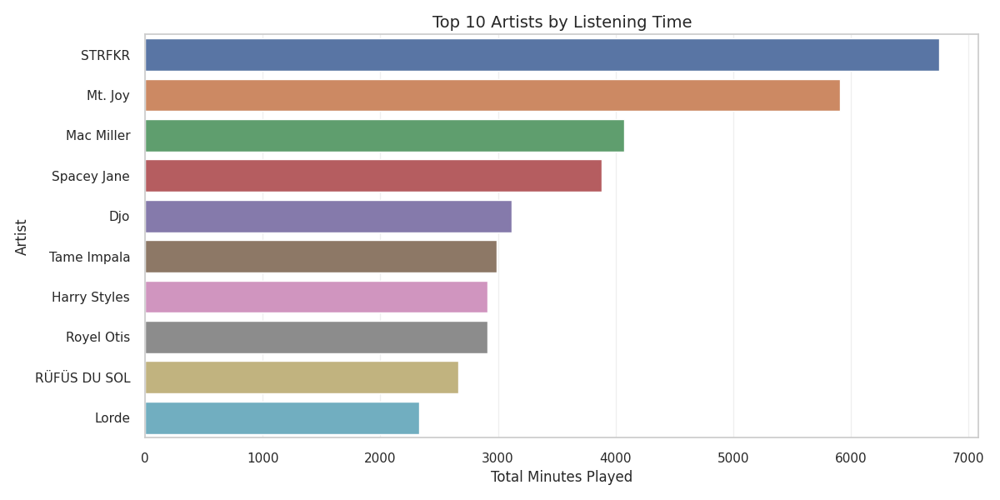

#### Top 10 Artists by Number of Plays

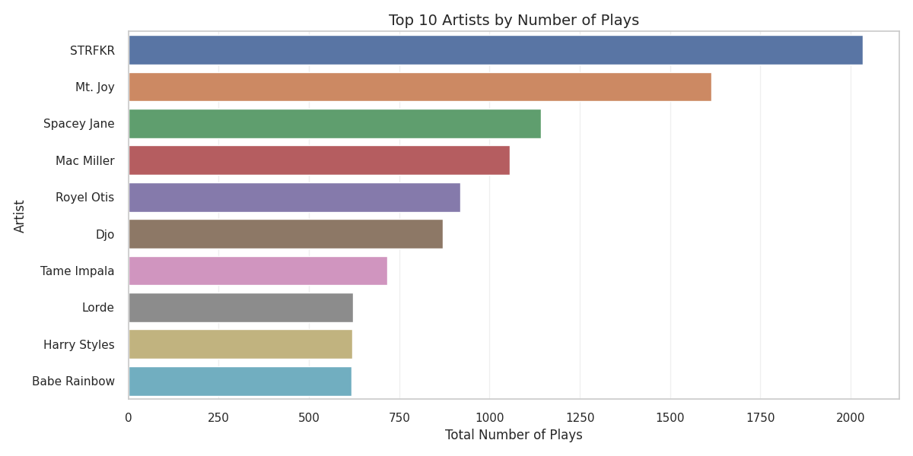

#### Top 5 Artists' Listening Time Over Months

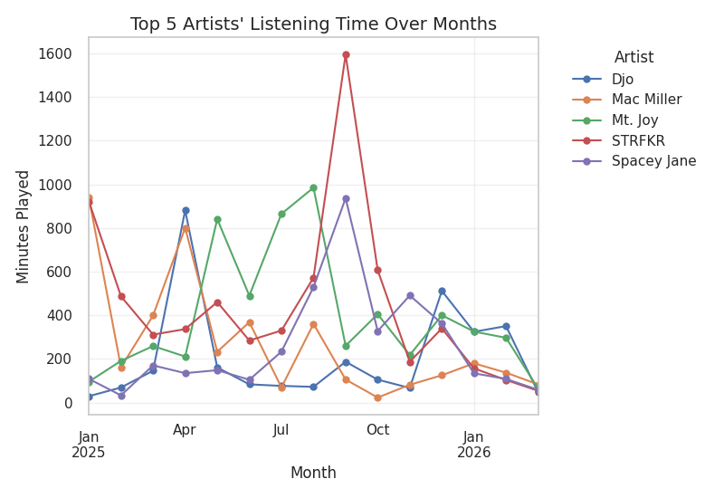

#### Top 10 Tracks by Listening Time

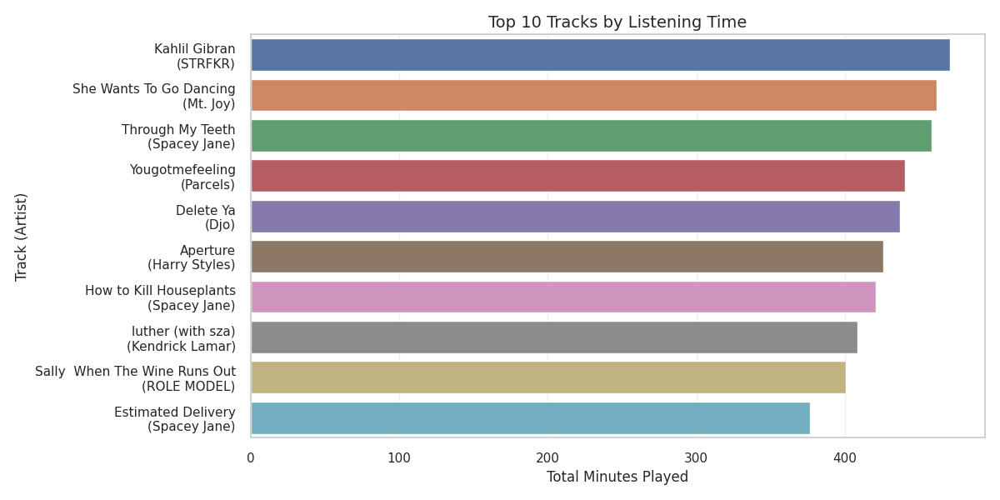

#### Top 10 Tracks by Number of Plays

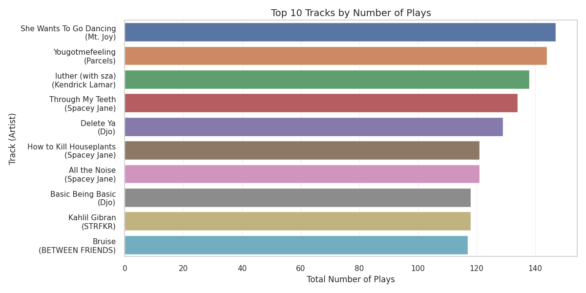

#### Top 10 Tracks' Listening Time Over Months

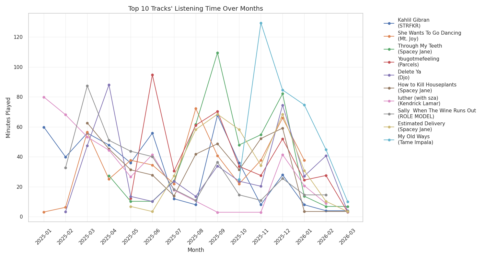

#### Artist and Track Diversity Over Time

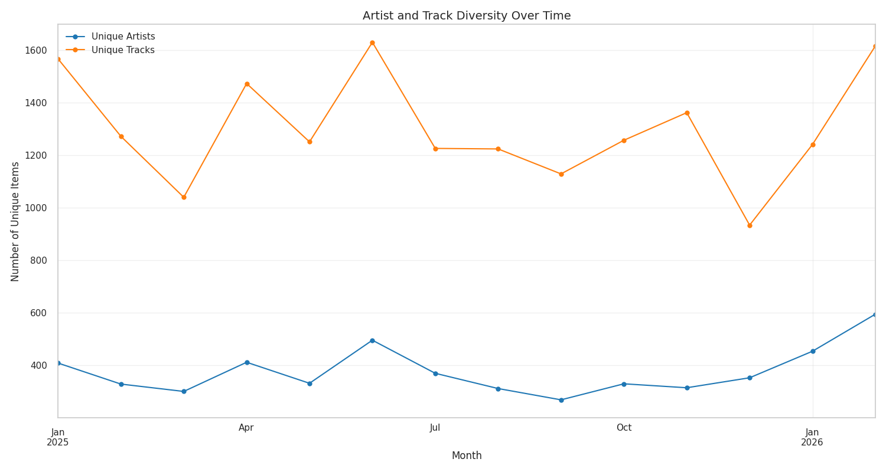

#### New Artists Discovered per Month

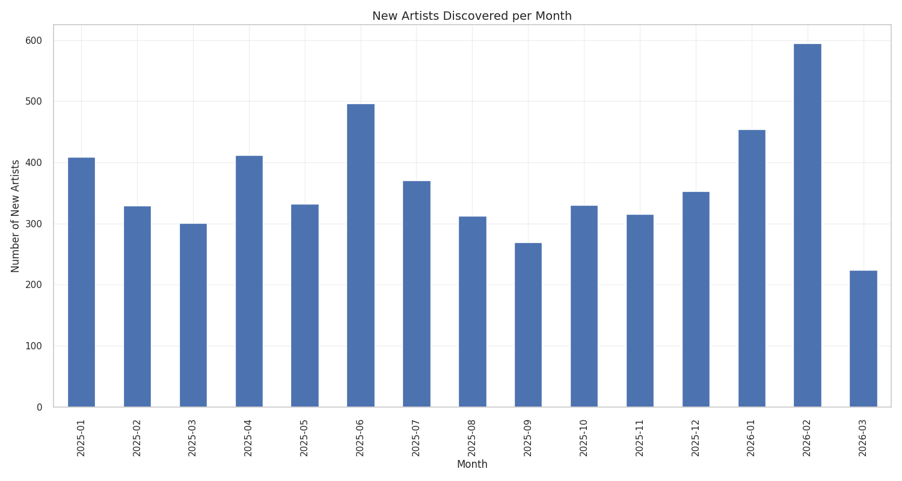

#### New Tracks Discovered per Month

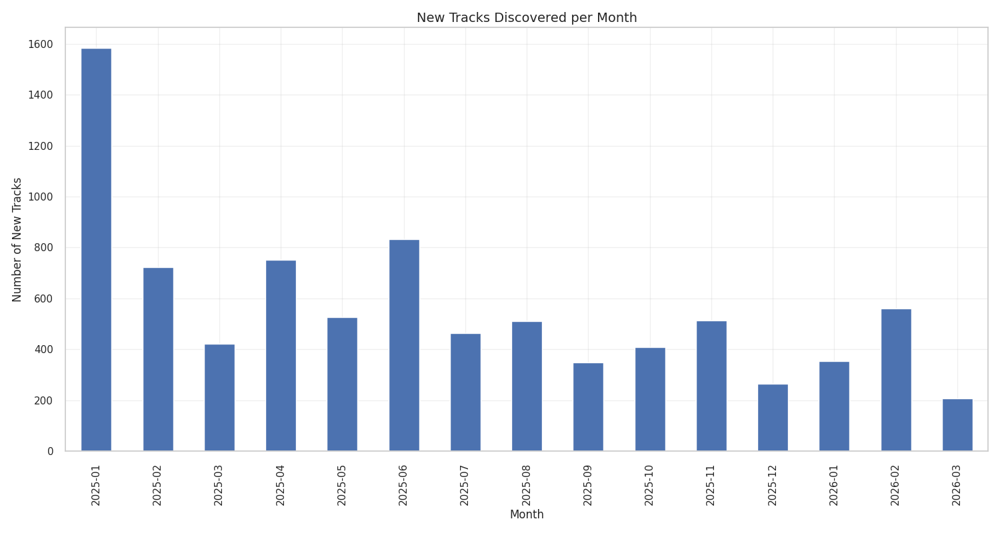

#### Daily Listening Time

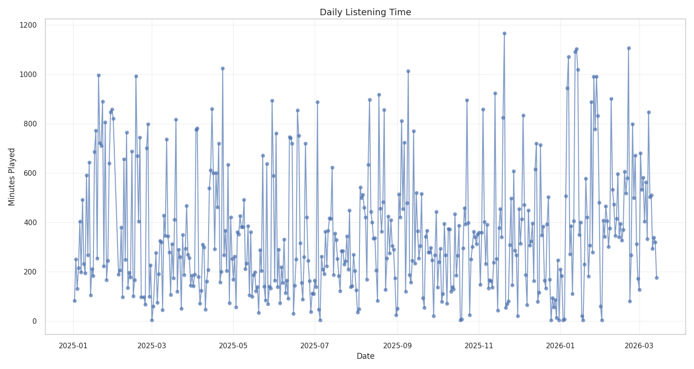

#### Listening Time by Hour of Day

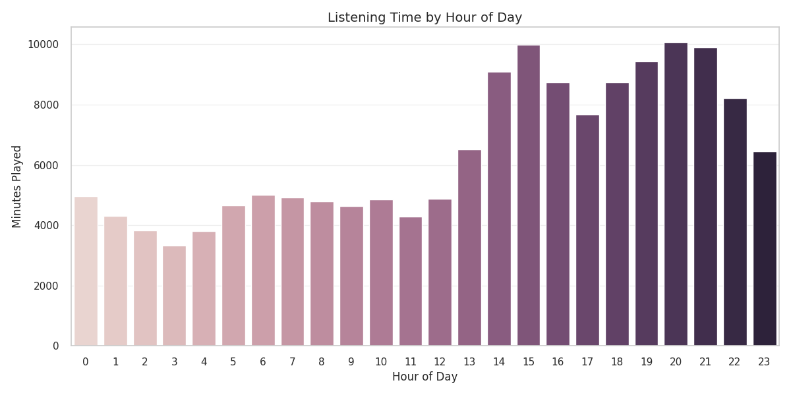

#### Listening Time Heatmap (Day of Week × Hour)

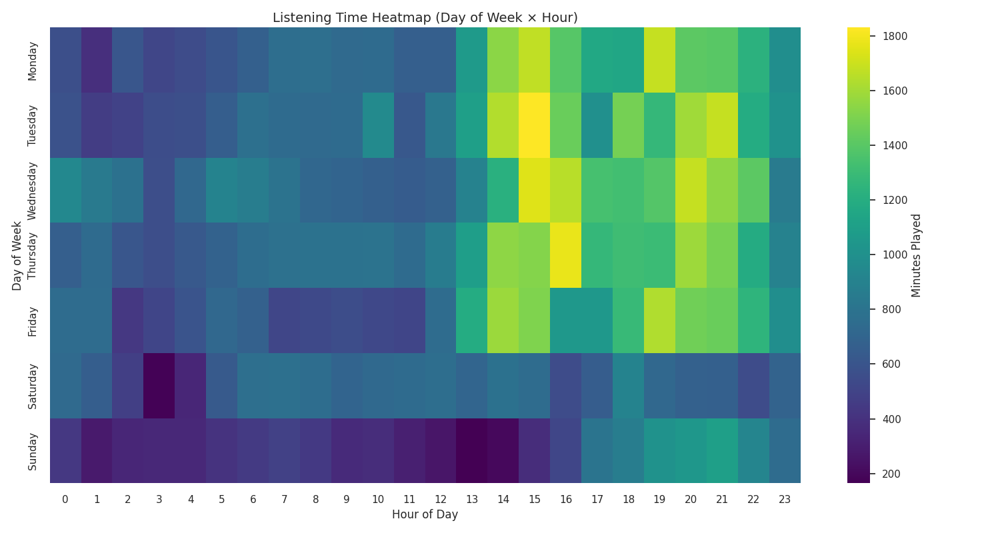

#### Monthly and Weekly Listening Time

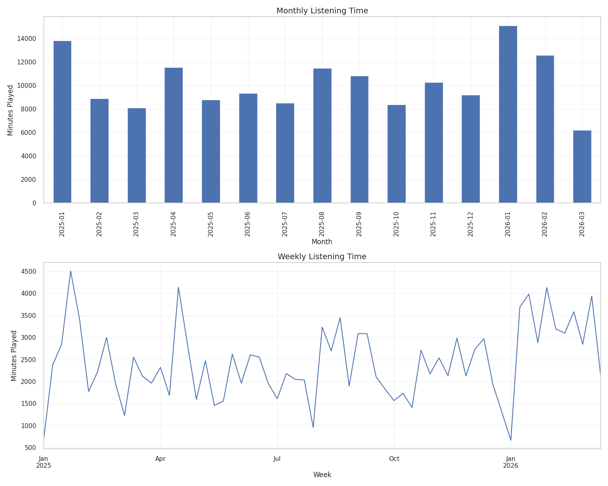

