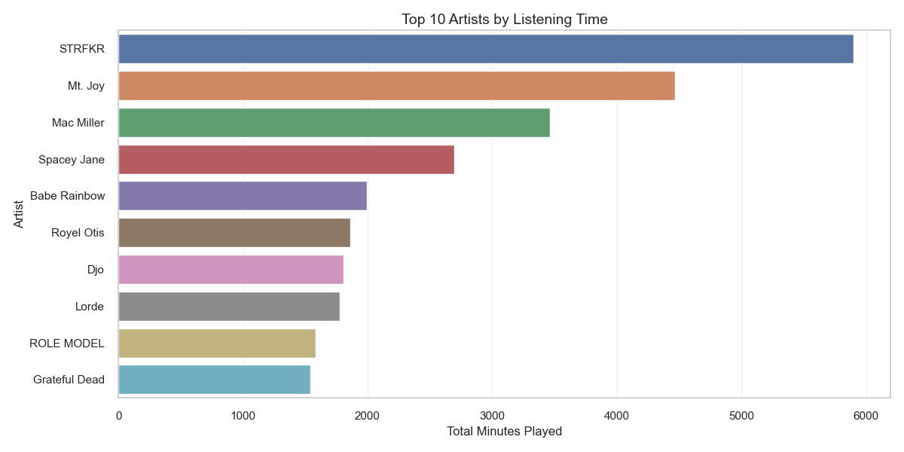
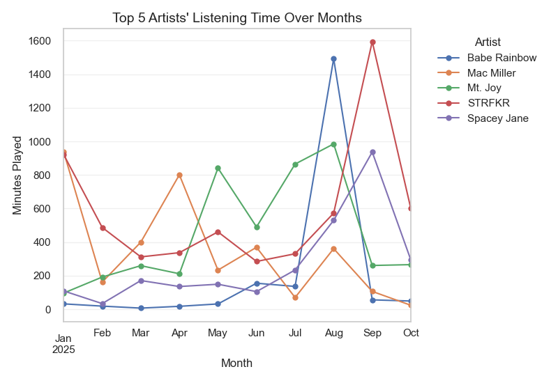
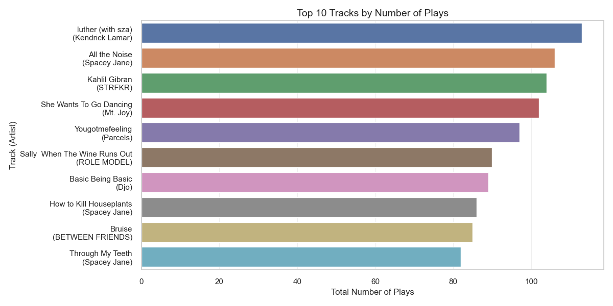
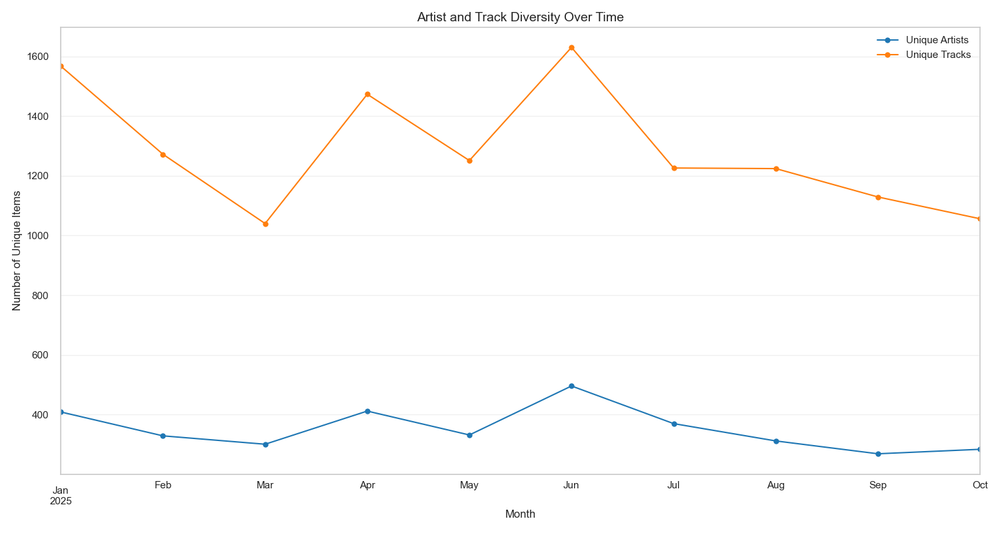
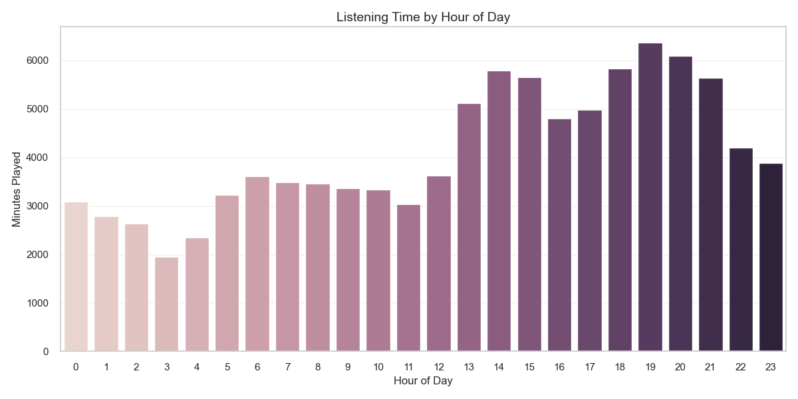
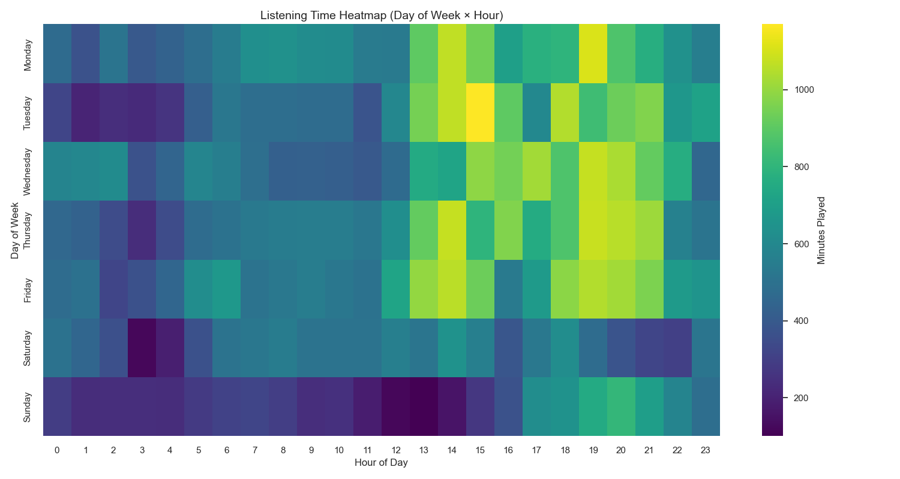

# spotify-data-tracker

Keeping track of all of my spotify listening history so that I can analyze the data.

Script run every hour with github actions to ensure no data is lost.

## Visualizations

### Latest Analysis

#### Top 10 Artists by Listening Time

#### Top 10 Artists by Number of Plays

#### Top 5 Artists' Listening Time Over Months

#### Top 10 Tracks by Listening Time

#### Top 10 Tracks by Number of Plays

#### Top 10 Tracks' Listening Time Over Months

#### Artist and Track Diversity Over Time

#### New Artists Discovered per Month

#### New Tracks Discovered per Month

#### Daily Listening Time

#### Listening Time by Hour of Day

#### Listening Time Heatmap (Day of Week × Hour)

#### Monthly and Weekly Listening Time

