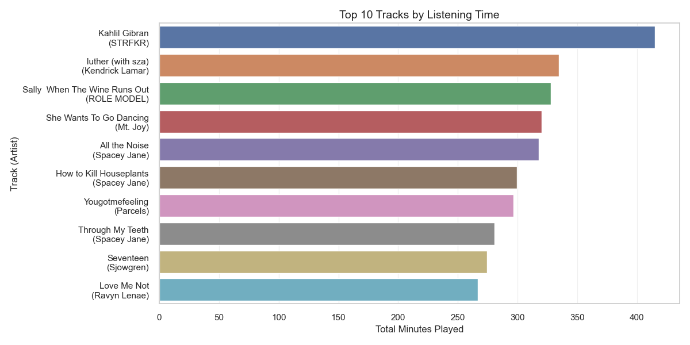
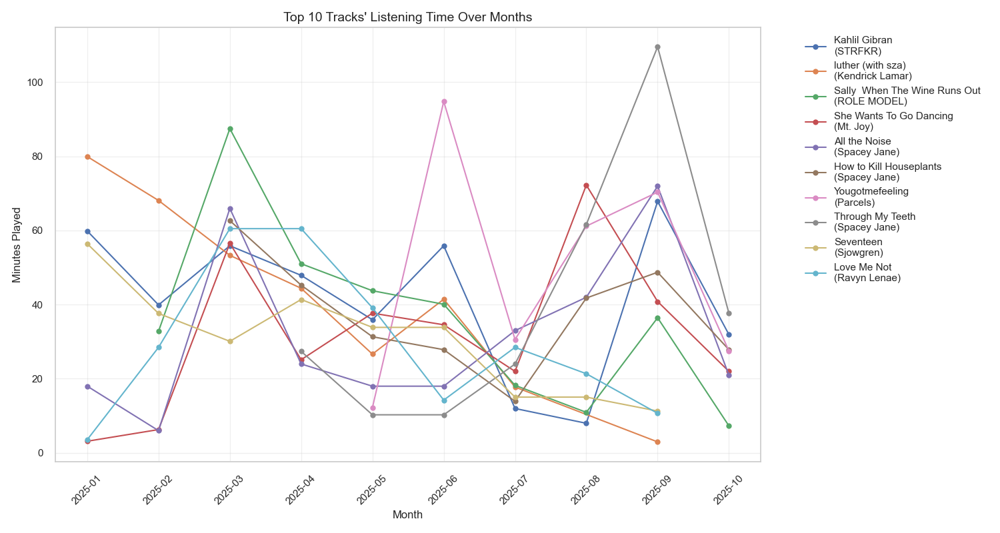
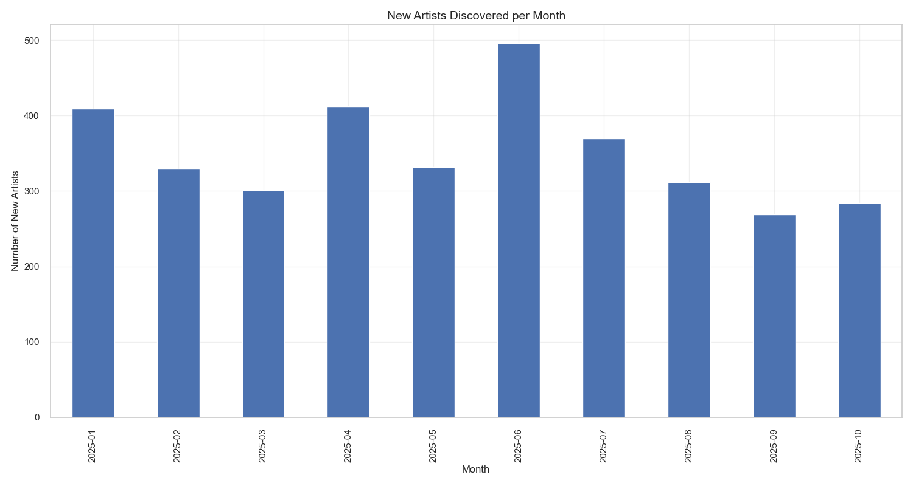
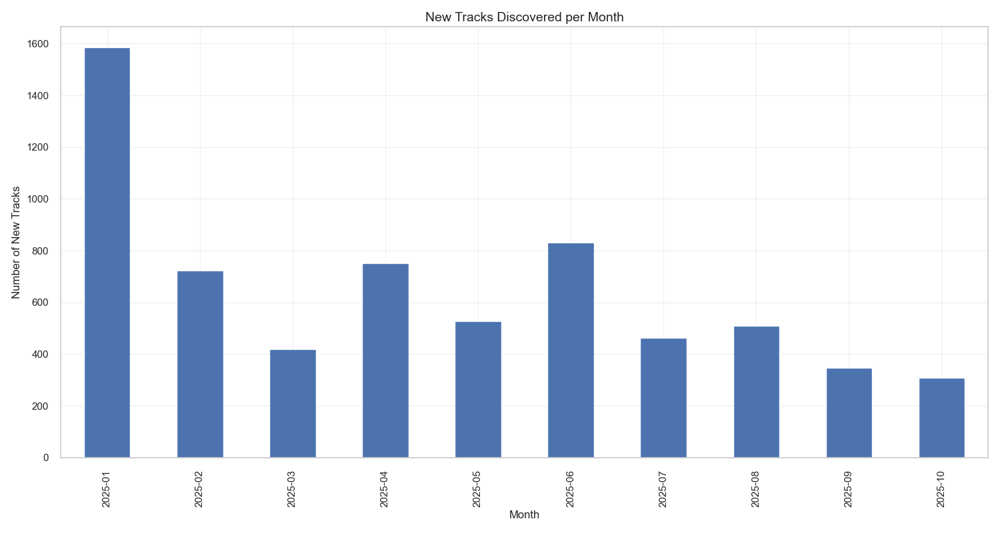
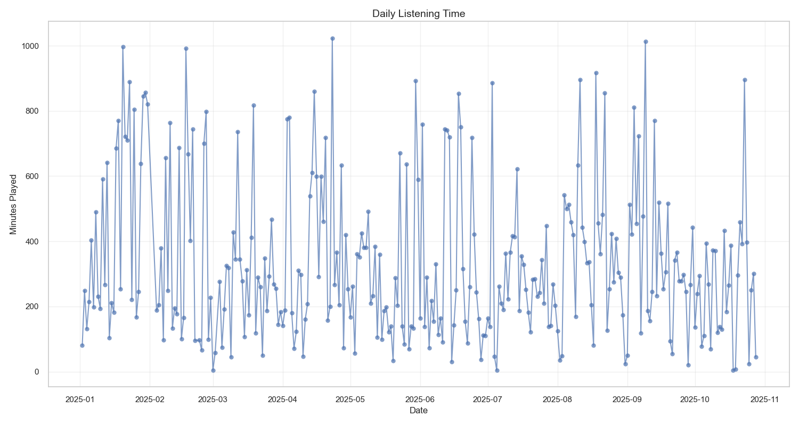

# spotify-data-tracker

Keeping track of all of my spotify listening history so that I can analyze the data.

Script run every hour with github actions to ensure no data is lost.

## Overview

This repository contains my personal Spotify listening history data and analysis. The data is collected hourly using GitHub Actions to ensure comprehensive tracking. The visualizations below provide insights into my listening habits, artist preferences, and music discovery patterns.

## Data Collection

- Data is collected every hour via GitHub Actions
- Each data point includes:
  - Timestamp
  - Track ID
  - Track Name  
  - Artist
  - Play Duration

## Visualizations

The visualizations are grouped into three main categories:

1. Artist Analysis - Shows artist preferences and listening patterns
2. Track Analysis - Reveals most played songs and track diversity
3. General Listening Patterns - Displays when and how much I listen

### Latest Analysis (Last Updated: 2025-07-13 02:31:21)

#### Top 5 Artists by Month

#### Top 5 Tracks by Month

#### Top 10 Artists by Listening Time

#### Top 10 Artists by Number of Plays

#### Top 5 Artists' Listening Time Over Months

#### Top 10 Tracks by Listening Time

#### Top 10 Tracks by Number of Plays

#### Top 10 Tracks' Listening Time Over Months

#### Artist and Track Diversity Over Time

#### New Artists Discovered per Month

#### New Tracks Discovered per Month

#### Daily Listening Time

#### Listening Time by Hour of Day

#### Listening Time Heatmap (Day of Week × Hour)

#### Monthly and Weekly Listening Time

